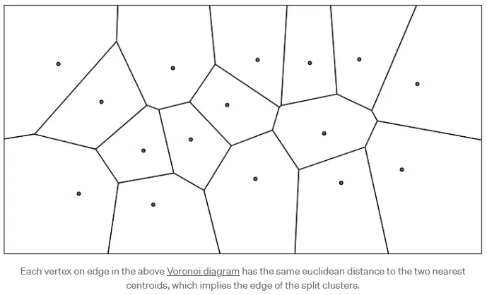
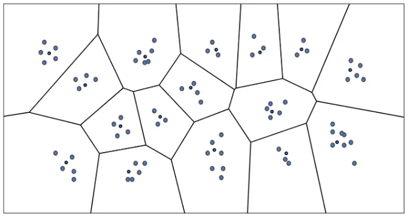
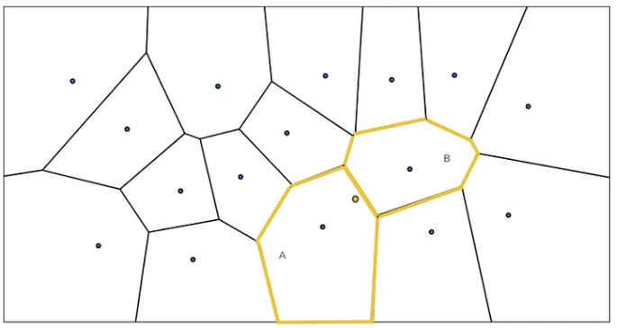
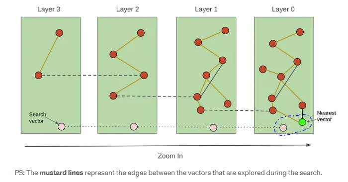

# PGVector: HNSW vs IVFFlat — 종합 연구

> **원문 출처:**  
> [PGVector: HNSW vs IVFFlat — A Comprehensive Study](https://medium.com/@bavalpreetsinghh/pgvector-hnsw-vs-ivfflat-a-comprehensive-study-21ce0aaab931)  
> by BavalpreetSinghh on Medium  
> 
> 이 문서는 원문을 한글로 번역한 것입니다.

---


## 1. 서론

조직 체계 없는 거대한 도서관에서 특정 책을 찾는다고 상상해보세요. 시간이 엄청나게 걸리겠죠? 그런데 비슷한 책끼리 묶어놓은 체계적인 시스템이 있다면 어떨까요? 이것이 바로 벡터 데이터베이스와 인덱스가 하는 일입니다!

데이터 세계에서는 정확히 일치하는 것보다 **유사한 것**을 찾아야 할 때가 많습니다. 벡터 데이터베이스는 데이터를 다차원 공간의 점으로 저장해서 "가까운" 항목을 빠르게 찾을 수 있게 해줍니다. 하지만 똑똑한 방식이라 해도 수백만 개의 데이터 포인트를 검색하는 건 여전히 느릴 수 있습니다.

PGVector는 세계에서 가장 많이 쓰이는 데이터베이스인 PostgreSQL에 벡터 검색 기능을 추가하는 강력한 확장입니다. PGVector는 IVFFlat과 HNSW라는 두 가지 인덱스를 제공하며, 각각 고유한 장점이 있습니다. 이 글에서는 두 인덱스를 깊이 있게 살펴보고 비교하여, 여러분의 요구사항에 맞는 것을 선택할 수 있도록 돕겠습니다.

---

## 2. 벡터 인덱스 이해하기

### 벡터 인덱스란 무엇인가?

벡터 인덱스는 벡터 데이터베이스의 **매우 체계적인 사서**라고 생각하면 됩니다. 데이터 포인트를 그룹화하고 분류하는 똑똑한 시스템을 만들어서 원하는 것을 훨씬 빠르게 찾을 수 있게 해줍니다.

일반 데이터베이스에서 인덱스는 특정 값을 빠르게 찾도록 돕습니다. 벡터 데이터베이스에서는 다차원 공간에서 주어진 점과 가장 가까운 이웃을 찾도록 돕습니다. "나랑 키가 정확히 같은 사람이 누구지?"가 아니라 "나랑 가장 비슷한 사람이 누구지?"를 묻는 것과 같습니다.

### 유사도 검색에서 왜 중요한가?

음악 추천 시스템을 만든다고 해봅시다. 사용자가 지금 듣고 있는 노래와 비슷한 노래를 찾고 싶습니다. 인덱스가 없다면 데이터베이스의 **모든 노래**와 지금 노래를 일일이 비교해야 합니다. 너무 느리고 비효율적이죠.

벡터 인덱스는 지름길을 만들어줍니다. 노래를 특성별로 그룹으로 나눠놓기 때문에, 비슷한 노래를 찾을 때 데이터베이스의 작은 일부분만 확인하면 됩니다. 덕분에 수백만 곡이 있어도 유사도 검색이 엄청 빠릅니다.

---

## 3. PGVector의 인덱스 타입

PGVector는 두 가지 강력한 인덱스 타입을 제공합니다: IVFFlat과 HNSW. 각각을 자세히 살펴보겠습니다.

### 3.1 IVFFlat

#### IVFFlat의 작동 방식

IVFFlat은 똑똑한 파일 정리 시스템처럼 작동합니다:

1. 모든 벡터를 여러 클러스터로 나누고, 각 클러스터마다 중심점(centroid)을 만듭니다.
2. 검색할 때는 먼저 쿼리와 가장 가까운 클러스터 중심들을 찾습니다.
3. 그 다음 선택된 클러스터 안에서만 검색해서 가장 가까운 벡터를 찾습니다.

도서관을 장르별로 정리해놓고, 원하는 책을 찾을 때 관련 장르에서만 찾는 것과 비슷합니다.

#### 알고리즘 개요

IVFFlat은 특히 대규모 데이터셋에서 고차원 벡터의 효율적인 최근접 이웃 검색에 사용되는 양자화 기반 인덱싱 기법입니다. 핵심 아이디어는 벡터 양자화로 벡터들을 클러스터로 묶어서, 쿼리 시 검색해야 할 후보 벡터 수를 줄이는 것입니다.

**양자화 기반 인덱싱:**

양자화에서는 데이터셋을 클러스터로 나누고, 각 클러스터마다 대표 벡터(centroid)를 지정합니다. 이렇게 하면 전체 데이터셋을 다 검색하지 않고 클러스터 일부만 검색하면 되므로 복잡도가 줄어듭니다.

**클러스터링 (오프라인 단계):**

- 검색 전에 k-means 같은 클러스터링 알고리즘으로 데이터셋을 k개 클러스터로 나눕니다. 각 클러스터는 centroid(클러스터 중심을 나타내는 벡터)로 표현됩니다.



- [Voronoi diagram](https://en.wikipedia.org/wiki/Voronoi_diagram)은 두 개의 가장 가까운 centroid에 대해 동일한 유클리드 거리를 갖는데, 이는 분할된 클러스터의 가장자리를 의미합니다.

- 각 데이터 포인트(벡터)는 가장 가까운 centroid에 할당됩니다. 이는 데이터 포인트가 이제 k개의 클러스터로 구성되며, 각 클러스터에는 다른 centroid보다 해당 centroid에 더 가까운 벡터가 포함됨을 의미합니다.



**역 인덱스:**

- IVFFlat은 역 인덱스를 사용하여 데이터를 구성합니다. 각 centroid(클러스터)에 대해 해당 centroid에 할당된 데이터 포인트(벡터) 목록을 유지합니다.
- 이렇게 하면 centroid와 근처 벡터의 매핑이 생성되어 검색 프로세스 중에 관련 벡터에 빠르게 액세스할 수 있습니다. 각 centroid는 "버킷" 역할을 하며, 해당 centroid에 할당된 벡터가 해당 버킷에 저장됩니다.


**검색 프로세스 (온라인 단계):**

- 쿼리 벡터가 주어지면 첫 번째 단계는 쿼리 벡터에 가장 가까운 centroid(클러스터)를 식별하는 것입니다. 이는 쿼리를 centroid 벡터와 비교하여 수행됩니다.

- 가장 가까운 centroid가 식별되면(일반적으로 둘 이상), 해당 centroid의 해당 역 인덱스(버킷)에 저장된 벡터로 검색이 제한됩니다.

- 선택된 클러스터 내에서의 검색은 brute-force 검색을 사용하여 해당 클러스터 내에서 최근접 이웃을 찾는 방식으로 수행되며, 이는 전체 데이터셋을 검색하는 것보다 계산적으로 더 효율적입니다.

**Flat 인덱싱:**

- IVFFlat의 "Flat"은 선택된 클러스터 내에서 brute-force 검색(또는 flat 검색)을 사용한다는 것을 의미합니다. 더 복잡한 하위 양자화 방법(예: PQ 또는 OPQ)과 달리, 클러스터 내부의 벡터는 있는 그대로 저장되고 검색됩니다.
- 이렇게 하면 IVFFlat이 더 단순하고 유연해지지만 다른 양자화 방법에 비해 메모리 효율성은 떨어집니다.

#### 인덱스 구축:

**k-means 클러스터링:**

- 알고리즘은 데이터셋에 k-means 클러스터링을 적용하여 벡터 공간을 Voronoi 셀로 분할합니다. 이러한 셀은 셀 내부의 모든 점이 다른 centroid보다 해당 centroid에 더 가까운 클러스터를 나타냅니다.

**Centroid 표현:**

- 각 Voronoi 셀은 해당 클러스터의 중심점인 centroid 벡터로 표현됩니다. 이러한 centroid는 유사한 벡터를 함께 그룹화하기 위한 참조점 역할을 합니다.

**벡터 할당 (역 리스트):**

- 데이터셋의 각 벡터는 가장 가까운 centroid(즉, 가장 가까운 클러스터)에 할당됩니다.
- 벡터는 역 리스트(centroid당 하나의 리스트)에 저장되며, 각 리스트는 특정 centroid와 연관된 벡터를 보유합니다. 이러한 리스트는 각 Voronoi 셀에 속하는 벡터를 나타내며 검색 중 효율적인 조회를 가능하게 합니다.

#### 검색 프로세스:

**가장 가까운 Centroid 찾기 (Probing):**

- 쿼리 벡터가 주어지면 첫 번째 단계는 가장 가까운 centroid(클러스터)를 식별하는 것입니다.
- 알고리즘은 검색할 `nprobe`개의 가장 가까운 centroid를 식별합니다. 여기서 `nprobe`는 검색을 위해 고려되는 클러스터(역 리스트) 수를 제어하는 매개변수입니다. 더 많은 centroid를 탐색할수록 검색이 더 철저하고(정확하게) 되지만 검색 시간이 증가합니다.

**역 리스트 스캔:**

- `nprobe`개의 가장 가까운 centroid를 선택한 후, 알고리즘은 역 리스트(해당 centroid에 할당된 벡터 리스트)를 스캔합니다.
- 이러한 역 리스트 내의 벡터가 최근접 이웃 검색의 후보입니다.

**정확한 거리 계산 수행:**

- 선택된 역 리스트의 각 후보 벡터에 대해, 알고리즘은 쿼리 벡터와 리스트의 벡터 간에 정확한 거리 계산(예: 코사인 유사도 또는 유클리드 거리)을 수행합니다. 이 프로세스는 쿼리 벡터를 리스트의 모든 벡터와 비교하기 때문에 "brute force"라고 합니다. 전체 데이터셋에 대한 전통적인 brute-force 검색과 달리, 이는 훨씬 더 작은 벡터 하위 집합(선택된 centroid에 할당된 것들)으로 제한됩니다.
- 결과는 거리 메트릭(예: 유클리드 거리 또는 코사인 유사도)에 따라 순위가 매겨지고, 최근접 이웃이 최종 결과로 반환됩니다.

#### IVFFlat의 주요 매개변수와 효과

**1. lists (클러스터 수):**

**설명:** k-means 클러스터링 단계에서 생성되는 클러스터(또는 centroid) 수입니다. 이것은 벡터가 그룹화되고 역 리스트에 할당되는 방식을 결정합니다.

**효과:**
- `lists`가 높을수록 검색의 세분성이 증가하여 재현율이 향상되지만 인덱스 크기와 구축 시간도 증가합니다.
- `lists`가 낮을수록 인덱스 크기와 구축 시간이 줄어들지만 너무 많은 벡터를 더 적은 클러스터로 그룹화하여 재현율이 저하될 수 있습니다.

**일반적인 범위:** 최적의 `lists` 수는 일반적으로 sqrt(n)과 n/1000 사이에 있으며, 여기서 n은 데이터셋의 벡터 수입니다.

**2. nprobe (쿼리 중 검색할 클러스터 수):**

**설명:** 쿼리 시간에 검색되는 centroid(또는 클러스터)의 수입니다. 단일 클러스터를 검색하는 대신 알고리즘은 정확도를 향상시키기 위해 여러 클러스터를 검색합니다.

**효과:**
- `nprobe`가 높을수록 더 많은 클러스터를 검색하기 때문에 재현율이 증가하여 쿼리에 더 가까운 벡터를 찾을 가능성이 높아집니다.
- 그러나 더 많은 역 리스트가 스캔되고 더 많은 벡터를 평가해야 하므로 검색 시간이 증가합니다.

**일반적인 설정:** 일반적인 휴리스틱은 속도와 재현율 간의 균형을 위해 `nprobe`를 `sqrt(lists)`로 설정하는 것입니다.

**3. distance metric:**

**설명:** 벡터 간 거리를 측정하는 데 사용되는 메트릭으로, 유클리드 거리 또는 코사인 유사도 등이 있습니다.

**효과:**
- 적절한 거리 메트릭을 선택하는 것은 정확한 결과를 얻는 데 중요합니다. 유클리드 거리는 실수 값 벡터에 일반적으로 사용되며, 코사인 유사도는 텍스트 임베딩에 자주 사용됩니다.

**조정:** 이 매개변수는 특정 애플리케이션 및 데이터셋에 따라 선택할 수 있습니다.

---

### 3.2 HNSW (Hierarchical Navigable Small World)

#### HNSW의 작동 방식

HNSW는 여러 단계의 지도처럼 작동합니다:

1. 각 점을 가장 가까운 이웃들과 연결하는 그래프를 만듭니다.
2. 이 그래프를 여러 층(레이어)으로 쌓아올리는데, 위층으로 갈수록 연결이 적어집니다.
3. 검색할 때는 맨 위 층에서 시작해서 빠르게 올바른 영역으로 좁혀나갑니다.

세계 지도 → 국가 지도 → 도시 지도 순으로 확대하면서 목적지를 찾아가는 것과 비슷합니다.

#### 알고리즘 개요

HNSW(Hierarchical Navigable Small World)는 고차원 공간에서 효율적인 근사 최근접 이웃(ANN) 검색을 위한 그래프 기반 인덱싱 방법입니다. HNSW 구조는 "스킵 리스트"와 비슷한데, 벡터를 여러 레이어로 구성하고 각 레이어마다 노드 수를 점점 줄여서 레이어 간 효율적인 탐색이 가능합니다.



**그래프 구조:**

- HNSW는 각 데이터 포인트를 노드로 하는 그래프로 만들어집니다. 노드 간 엣지는 점들이 얼마나 가까운지(코사인/유클리드 거리 등)를 나타냅니다. 각 레이어의 각 점은 그 레이어 안에서 `m`개의 최근접 이웃과 연결됩니다.

**다층 구조:**

- HNSW는 노드를 여러 레이어(층)로 구성합니다. 상위 레벨은 노드가 적고 연결도 적은 반면, 하위 레벨은 노드가 많고 연결도 촘촘합니다.
- 각 레벨은 "스킵 리스트"처럼 작동하며, 상위 레벨 노드들이 하위 레벨의 진입점 역할을 해서 빠른 탐색이 가능합니다.
- 그래프 탐색성을 유지하기 위해 휴리스틱 삽입 알고리즘을 사용합니다.

#### 검색 프로세스:

**최상위 레이어의 임의 지점에서 시작:**

- HNSW 그래프는 여러 레이어로 구성되며, 최상위 레이어가 가장 추상적이고 노드가 가장 적습니다.
- 검색은 데이터셋의 희박한 하위 집합을 포함하는 최상위 레이어의 임의 또는 진입 지점에서 시작됩니다.

**탐욕적 검색을 사용하여 레이어를 통해 하강:**

- 검색은 각 레벨에서 탐욕적 검색을 수행하여 위에서 아래로 레이어별로 진행됩니다.
- 탐욕적 검색은 각 단계에서 알고리즘이 쿼리 포인트에 가장 가까운 이웃 노드로 이동한다는 것을 의미합니다(유클리드 또는 코사인 거리와 같은 거리 메트릭 기반).
- 각 레이어에서 목표는 쿼리 포인트에 더 가까이 가져다주는 노드로 이동하여 쿼리 포인트에 더 가까워지는 것입니다.

**최하위 레이어에서 빔 검색 수행:**

- 그래프가 가장 밀집되어 있고 모든 데이터 포인트를 포함하는 최하위 레이어에 도달하면, 알고리즘은 탐욕적 검색에서 빔 검색으로 전환합니다.
- 빔 검색은 탐색할 노드의 후보 목록(또는 "빔")의 크기를 정의하는 매개변수 `ef_search`에 의해 제어됩니다.
- 빔 검색에서 알고리즘은 `ef_search`개의 가장 가까운 후보를 추적하고 최근접 이웃을 찾을 때까지 해당 후보에서 이웃 검색을 계속 확장합니다.

**스몰 월드 속성:**

- HNSW 그래프는 스몰 월드 속성을 가지고 있어 비교적 짧은 경로로 두 노드 간을 쉽게 탐색할 수 있기 때문에, 알고리즘은 상위 레이어에서 근사 이웃을 빠르게 찾을 수 있습니다.
- 하강하면서 처음에는 이웃이 근사치이지만, 하위 레이어에서 검색이 점점 더 정확해지며 가장 가까운 이웃에 도달하는 데 몇 번의 홉만 필요합니다.

#### 주요 매개변수와 효과

**1. m: 요소당 최대 연결 수 (기본값: 16)**

**설명:** 이 매개변수는 그래프의 각 노드가 동일한 레이어의 다른 노드에 가질 수 있는 링크 또는 연결의 최대 수를 정의합니다.

**효과:**
- `m`이 높을수록 각 요소가 가지는 이웃 수가 증가하여 재현율(검색 정확도)이 향상되지만 인덱스 크기가 커지고 구축 시간이 느려집니다.
- `m`이 낮을수록 메모리 사용량과 구축 시간이 줄어들지만 검색 품질이 저하될 수 있습니다.

**일반적인 범위:** 값은 일반적으로 8에서 64 사이입니다.

**2. ef_construction: 구축 중 동적 후보 목록 크기 (기본값: 64)**

**설명:** HNSW 그래프 구축 중에 이 매개변수는 새 벡터를 추가하는 동안 탐색되는 이웃의 후보 목록 크기를 제어합니다.

**효과:**
- `ef_construction` 값이 클수록 더 많은 후보가 평가되기 때문에 인덱스 품질이 향상되어 더 나은 연결이 이루어지고 결과적으로 재현율이 향상됩니다.
- 그러나 이는 구축 시간과 메모리 사용량 증가라는 대가가 따릅니다.

**일반적인 범위:** 고차원 데이터의 경우 일반적인 값은 100에서 500 사이입니다.

**3. ef_search: 검색 중 동적 후보 목록 크기 (기본값: 40)**

**설명:** 검색 프로세스 중에 이 매개변수는 최근접 이웃 검색을 위해 탐색되는 벡터의 후보 목록 크기를 제어합니다.

**효과:**
- `ef_search` 값이 높을수록 검색 프로세스 중에 더 많은 이웃이 고려되기 때문에 재현율(정확도)이 향상됩니다.
- 그러나 `ef_search`를 증가시키면 더 많은 노드를 평가해야 하므로 검색 속도가 느려집니다.

**조정:** 다른 매개변수와 달리 `ef_search`는 인덱스를 재구축할 필요 없이 쿼리 시간에 조정할 수 있어 애플리케이션 요구 사항에 따라 유연성을 제공합니다.

**일반적인 범위:** 특정 재현율 및 속도 트레이드오프에 따라 조정되지만, 고정확도 시나리오에서는 일반적으로 100에서 200 사이의 값이 사용됩니다.

#### 시간 및 공간 복잡도

- **구축 시간:** O(n log(n) * m * ef_construction), 여기서 n은 벡터 수입니다.
- **검색 시간:** 평균 O(log(n) * ef_search).
- **공간 복잡도:** O(n * m * dim), 여기서 dim은 벡터 차원입니다.

#### 기술적 고려사항

- HNSW는 고차원에서 잘 작동하며 많은 다른 ANN 알고리즘을 능가합니다.
- 인덱스 구조는 동적 삽입을 허용하지만 삭제는 더 복잡합니다.
- 다층 접근 방식은 검색 중 탐색과 활용 간의 좋은 균형을 제공합니다.

---

## 4. IVFFlat과 HNSW 비교

두 인덱스를 여러 측면에서 비교해봅시다:

### 4.1 구축 시간

IVFFlat이 일반적으로 HNSW보다 빠르게 구축됩니다. 특히 대규모 데이터셋에서 더 그렇습니다:

- IVFFlat의 k-means 클러스터링은 O(nkd) 복잡도로, HNSW의 O(n log(n) * m * ef_construction)보다 보통 빠릅니다.
- HNSW의 그래프 구축 과정은 각 점마다 거리 계산과 그래프 업데이트를 해야 해서 더 복잡합니다.

정확한 구축 시간은 하드웨어, 데이터셋 특성, 구현 방식에 따라 크게 달라지지만, 같은 데이터셋에 대해 IVFFlat 인덱스가 HNSW보다 몇 배 빠르게 구축되는 게 일반적입니다.

HNSW 알고리즘 저자들의 연구에서도, HNSW가 뛰어난 쿼리 성능을 제공하지만 인덱스 구축 시간은 IVFFlat 같은 양자화 기반 방법보다 일반적으로 길다고 언급했습니다.

실제 성능은 상황에 따라 다를 수 있으므로, 가장 정확한 비교를 위해서는 여러분의 데이터셋과 하드웨어로 직접 벤치마크해보는 것이 좋습니다.

### 4.2 인덱스 크기

IVFFlat이 일반적으로 HNSW보다 메모리를 덜 차지합니다:

- IVFFlat은 centroid와 벡터 ID를 저장해서 O(nd) 공간 복잡도를 가집니다.
- HNSW는 각 점의 그래프 연결 정보를 저장해서 O(n * m * dim) 공간 복잡도를 가집니다.

이런 공간 복잡도는 각 알고리즘의 원 논문에서 나온 내용입니다. 하지만 실제 인덱스 크기는 구현 방식과 데이터셋 특성에 따라 달라질 수 있으니, 정확한 비교를 위해서는 실제 사용 환경에서 벤치마크하는 것이 좋습니다.

### 4.3 검색 속도

HNSW는 일반적으로 특히 높은 재현율 시나리오에서 IVFFlat보다 검색 속도가 우수합니다:

- IVFFlat의 검색 시간은 프로브 수에 따라 선형적으로 증가합니다.
- HNSW의 로그 검색 시간은 데이터셋 크기에 따라 더 잘 확장됩니다.

이러한 성능 차이는 Malkov와 Yashunin의 원본 HNSW 논문을 포함한 여러 연구에서 문서화되었으며, 이는 IVFFlat과 같은 양자화 기반 방법에 비해 HNSW의 우수한 쿼리 성능을 입증했습니다.

### 4.4 재현율 vs 속도 트레이드오프

두 인덱스 모두 재현율-속도 트레이드오프를 조정할 수 있지만 방식이 다릅니다:

- **IVFFlat:** 쿼리 시간에 `nprobe`를 조정합니다. 더 높은 값은 재현율을 증가시키지만 속도를 선형적으로 감소시킵니다.
- **HNSW:** 쿼리 시간에 `ef_search`를 조정합니다. 더 큰 값은 재현율을 증가시키며 속도 감소는 준선형적입니다.

HNSW는 일반적으로 특히 고차원 데이터에 대해 더 나은 재현율-속도 트레이드오프를 달성합니다. 이러한 행동은 다양한 데이터셋 및 차원에 걸쳐 다양한 ANN 알고리즘을 평가하는 Li et al.의 비교 연구에서 심층적으로 분석됩니다.

### 4.5 차원 처리

- IVFFlat의 성능은 클러스터링 접근 방식에 영향을 미치는 "차원의 저주"로 인해 차원이 증가함에 따라 더 빠르게 저하됩니다.
- HNSW는 그래프 기반 구조 덕분에 고차원에서도 비교적 좋은 성능을 유지합니다.

이러한 특성은 다양한 차원에 걸쳐 다양한 인덱싱 방법의 성능을 검토하는 Wang et al.의 종합 설문 조사에서 논의됩니다.

### 4.6 데이터 분포 민감도

- IVFFlat은 데이터 분포에 더 민감합니다. 왜곡된 데이터는 불균형한 클러스터로 이어져 성능에 영향을 줄 수 있습니다.
- HNSW는 그래프 기반 특성으로 인해 일반적으로 다양한 데이터 분포에 더 강건합니다.

인덱스 성능에 대한 데이터 분포의 영향은 다양한 데이터 분포에 걸쳐 여러 인덱싱 방법을 평가하는 Echihabi et al.의 연구에서 탐구됩니다.

### 4.7 증분 업데이트

- IVFFlat은 증분 업데이트를 잘 처리하지 못합니다. 새 점이 기존 클러스터에 할당되지만 centroid는 재계산되지 않아 시간이 지남에 따라 성능이 저하됩니다.
- HNSW는 효율적인 삽입을 지원하여 새 데이터가 추가됨에 따라 좋은 성능을 유지합니다. 그러나 삭제는 더 복잡하며 종종 소프트 삭제로 구현됩니다.

이러한 인덱스의 업데이트 기능은 원본 HNSW 논문과 Wang et al.의 설문 조사에서 논의됩니다.

### 4.8 병렬화

- IVFFlat의 검색 프로세스는 병렬화하기가 더 쉽습니다. 서로 다른 클러스터에서의 검색을 독립적으로 수행할 수 있기 때문입니다.
- HNSW의 그래프 탐색은 본질적으로 순차적이어서 병렬화가 더 어렵지만, 병렬 그래프 구축을 위한 일부 접근 방식이 존재합니다.

이러한 인덱스의 병렬화 전략은 HNSW 병렬화에 대한 Zhao et al.의 작업을 포함한 여러 연구에서 탐구됩니다.

---

## 5. 실제 사용 사례

### IVFFlat이 빛나는 시나리오

1. **정적 데이터셋:** 데이터가 자주 변경되지 않는 경우 IVFFlat이 훌륭한 선택이 될 수 있습니다. 예를 들어, 천문학을 위한 별자리 데이터베이스는 업데이트가 거의 필요하지 않습니다.

2. **제한된 리소스:** 메모리나 디스크 공간이 부족할 때 IVFFlat의 작은 크기가 유리합니다.

3. **빈번한 재구축:** 인덱스를 정기적으로 재구축할 여유가 있다면 IVFFlat의 빠른 구축 시간이 유리합니다.

### HNSW가 선호되는 시나리오

1. **동적 데이터:** IoT 센서 데이터베이스와 같이 자주 변경되는 데이터의 경우 HNSW가 정확도를 더 잘 유지합니다.

2. **대규모 유사도 검색:** 이미지 검색이나 추천 시스템과 같이 속도가 중요한 애플리케이션에서 HNSW의 빠른 쿼리 시간은 매우 중요합니다.

3. **높은 정확도 요구사항:** 가능한 최고의 정확도가 필요하고 추가 메모리를 감당할 수 있다면 HNSW가 종종 더 나은 선택입니다.

---

## 6. 올바른 인덱스 선택 방법

IVFFlat과 HNSW 중에서 결정할 때 다음 요소를 고려하세요:

1. **데이터 크기 및 증가:** 매우 크거나 빠르게 성장하는 데이터셋의 경우 더 큰 크기에도 불구하고 HNSW가 더 나을 수 있습니다.

2. **업데이트 빈도:** 데이터가 자주 변경되면 HNSW를 선호합니다.

3. **검색 속도 요구사항:** 가능한 가장 빠른 검색이 필요하다면 HNSW가 적합합니다.

4. **구축 시간 제약:** 인덱스를 자주 재구축해야 한다면 IVFFlat이 더 적합할 수 있습니다.

5. **메모리 제약:** 메모리가 부족하다면 IVFFlat이 더 적은 공간을 사용합니다.

6. **정확도 요구:** 둘 다 높은 정확도를 달성할 수 있지만, HNSW는 일반적으로 조정이 덜 필요합니다.

**일반적인 규칙:**

- 인덱스 크기와 구축 시간을 우선시한다면 **IVFFlat을 선택**하세요.
- 검색 속도와 업데이트에 대한 복원력을 우선시한다면 **HNSW를 선택**하세요.

---

## 7. 실전 구현 예제

### Python을 사용한 PGVector 설정

```python
import psycopg2
import numpy as np
from psycopg2.extras import execute_values

# 데이터베이스 연결 매개변수
DB_NAME = "your_database"
DB_USER = "your_username"
DB_PASSWORD = "your_password"
DB_HOST = "localhost"
DB_PORT = "5432"

# 데이터베이스 연결
conn = psycopg2.connect(
    dbname=DB_NAME,
    user=DB_USER,
    password=DB_PASSWORD,
    host=DB_HOST,
    port=DB_PORT
)

# 커서 생성
cur = conn.cursor()

# vector 확장 활성화
cur.execute("CREATE EXTENSION IF NOT EXISTS vector;")

# 벡터 저장용 테이블 생성
cur.execute("""
    CREATE TABLE IF NOT EXISTS items (
        id SERIAL PRIMARY KEY,
        embedding VECTOR(3)
    );
""")

# 샘플 데이터 생성
num_vectors = 10000
vector_dim = 3
vectors = np.random.rand(num_vectors, vector_dim)

# 샘플 데이터 삽입
insert_query = "INSERT INTO items (embedding) VALUES %s"
vector_tuples = [(vector.tolist(),) for vector in vectors]
execute_values(cur, insert_query, vector_tuples)

# IVFFlat 인덱스 생성
cur.execute("""
    CREATE INDEX ON items USING ivfflat (embedding vector_cosine_ops) WITH (lists = 100);
""")

# IVFFlat 검색 매개변수 설정
cur.execute("SET ivfflat.nprobe = 10;")

# HNSW 인덱스 생성
cur.execute("""
    CREATE INDEX ON items USING hnsw (embedding vector_cosine_ops) WITH (m = 16, ef_construction = 64);
""")

# HNSW 검색 매개변수 설정
cur.execute("SET hnsw.ef_search = 100;")

# 변경사항 커밋
conn.commit()

# 유사도 검색 함수
def similarity_search(query_vector, index_type, k=5):
    if index_type not in ['ivfflat', 'hnsw']:
        raise ValueError("인덱스 타입은 'ivfflat' 또는 'hnsw'여야 합니다")
    
    query = f"""
        SELECT id, embedding <-> ARRAY{query_vector}::vector AS distance
        FROM items
        ORDER BY embedding <-> ARRAY{query_vector}::vector
        LIMIT {k};
    """
    
    cur.execute(f"SET enable_{index_type} = on;")
    cur.execute(query)
    results = cur.fetchall()
    
    print(f"\n{index_type.upper()}를 사용한 상위 {k}개 유사 항목:")
    for result in results:
        print(f"ID: {result[0]}, 거리: {result[1]}")

# 유사도 검색 수행
query_vector = np.random.rand(vector_dim).tolist()
similarity_search(query_vector, 'ivfflat')
similarity_search(query_vector, 'hnsw')

# 커서와 연결 닫기
cur.close()
conn.close()
```

특정 요구 사항과 데이터셋 특성에 따라 명령의 매개변수를 조정하는 것을 잊지 마세요.

---

## 결론

벡터 인덱스는 빠른 유사도 검색의 숨은 영웅입니다. PGVector는 PostgreSQL에 두 가지 강력한 옵션을 제공합니다: IVFFlat과 HNSW. 각각 장단점이 있습니다 — IVFFlat은 구축이 빠르고 크기가 작은 반면, HNSW는 검색이 매우 빠르고 데이터 변경에 더 강합니다.

둘 중 하나를 선택하는 것은 모든 상황에 맞는 "최선의" 옵션을 찾는 게 아니라, **여러분의 상황에 가장 적합한** 것을 찾는 겁니다. 결정할 때는 데이터 특성, 성능 요구사항, 리소스 제약을 고려하세요.

벡터 검색의 중요성이 계속 커지면서, 이 분야에서 더 많은 혁신이 나올 것으로 기대됩니다. PGVector는 이미 이런 고급 기술을 우리에게 친숙한 PostgreSQL 환경으로 가져와서, 벡터 검색을 그 어느 때보다 쉽게 만들고 있습니다.

---

## 참고문헌

1. Echihabi, K., Zoumpatianos, K., Palpanas, T., & Benbrahim, H. (2020). Return of the Lernaean Hydra: Experimental evaluation of data series approximate similarity search. Proceedings of the VLDB Endowment, 13(3), 403–420.

2. Jégou, H., Douze, M., & Schmid, C. (2011). Product quantization for nearest neighbor search. IEEE Transactions on Pattern Analysis and Machine Intelligence, 33(1), 117–128.

3. Johnson, J., Douze, M., & Jégou, H. (2017). Billion-scale similarity search with GPUs. arXiv. https://arxiv.org/abs/1702.08734

4. Li, W., Zhang, Y., Sun, Y., Wang, W., Zhang, W., & Lin, X. (2020). Approximate nearest neighbor search on high-dimensional data — experiments, analyses, and improvement. IEEE Transactions on Knowledge and Data Engineering, 32(8), 1475–1488.

5. Malkov, Y. A., & Yashunin, D. A. (2020). Efficient and robust approximate nearest neighbor search using hierarchical navigable small world graphs. IEEE Transactions on Pattern Analysis and Machine Intelligence, 42(4), 824–836.

6. PGVector. (n.d.). GitHub repository. https://github.com/pgvector/pgvector

7. PGVector. (n.d.). Documentation. https://github.com/pgvector/pgvector/blob/master/README.md

8. Tembo.io. (n.d.). Vector indexes in pgvector. https://tembo.io/blog/vector-indexes-in-pgvector

9. Wang, J., Liu, W., Kumar, S., & Chang, S. F. (2016). Learning to hash for indexing big data — a survey. Proceedings of the IEEE, 104(1), 34–57.

10. WebSVG. (n.d.). Voronoi diagram generator. https://websvg.github.io/voronoi/

11. Zhao, H., Zhang, Y., Jain, A., Gonzalez, J. E., & Stoica, I. (2021). Distributed hierarchical GPU parameter server for massive scale deep learning ads systems. Proceedings of Machine Learning and Systems, 3, 503–518.

12. Anthropic. (2024). Claude 3.5 Sonnet [AI model]. https://www.anthropic.com

13. OpenAI. (2023). ChatGPT [AI model]. https://www.openai.com/chatgpt

---

**벡터 인덱싱의 세계는 끊임없이 진화하고 있습니다. 호기심을 유지하고 계속 실험하면서 애플리케이션에서 유사도 검색의 힘을 활용하세요!**
